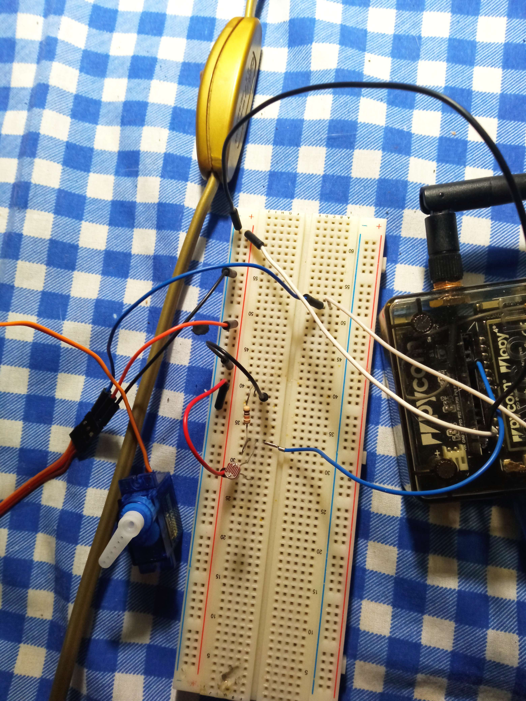

# Protótipo Ubicomp
2022-2023

Computação Móvel

Redes e Serviços de Comunicações I

**Desenvolvido por**

João Lopes - 37133

Rúben Pinto - 40115

## Descrição
Este código é referente a um protótipo de um sistema de estores automáticos utilizando um Pycom com um módulo LoPy, um sensor de luz LDR e um servo motor.

## Requisitos funcionais
- Se o servo estiver "aberto" e o LDR detetar uma luminosidade <=30%, o servo "fecha"
- Se o servo estiver "fechado" e o LDR detetar uma luminosidade de >= 50%, o servo "abre"
- A verificação do estado do LDR deve ser feita periodicamente (15 em 15 segundos para efeitos de teste)
- Os dados do LDR devem ser enviados para o ThingSpeak. Para tal, deve ser usado o protocolo MQTT
- Deve ser usado um protocolo de redes sem fios Wi-Fi ou LoRaWAN

## Montagem

## Vídeo do Protótipo
https://youtu.be/HxU-Rr5pvj8
